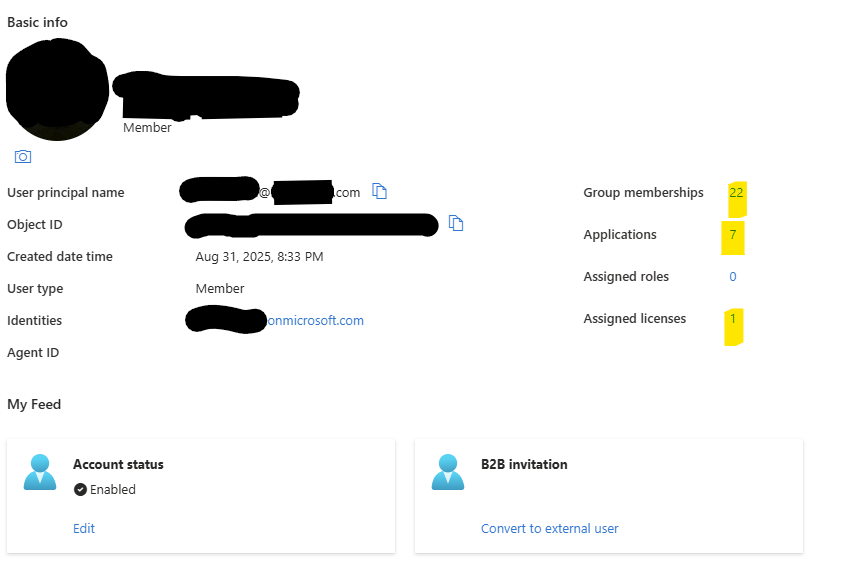

# Automated Onboarding & Offboarding Pipeline (ADP → Aquera → Okta → Azure)

This project showcases the design and implementation of a fully automated **Identity & Access Management (IAM) pipeline** for a firm of over 800 users. The goal was to eliminate manual onboarding/offboarding processes, reduce IT overhead, and enforce security best practices across the enterprise.

---

## 📖 Overview

- **Source of Truth:** ADP (HR system)  
- **Integration Layer:** Aquera (connector for HR-driven provisioning)  
- **Identity Platform:** Okta (group-based provisioning, licensing, and application assignment)  
- **Cloud Environment:** Azure/Entra ID (user creation, sync, and lifecycle management)

This pipeline ensures seamless **onboarding, access assignment, and offboarding**, driven entirely by attributes such as **title, department, and role criteria**.

---

## 🔎 Key Features

- **Automated Onboarding:**  
  - New hires in ADP automatically flow into Aquera and Okta.  
  - Users are provisioned in Azure/Entra ID.  
  - Default groups and licenses assigned based on title/department.  

- **Seamless Application Access:**  
  - Applications automatically assigned via Okta group rules.  
  - Role-based access (finance, legal, IT, etc.) with zero manual steps.  

- **Automated Offboarding:**  
  - Terminated employees in ADP trigger automatic deactivation.  
  - Okta license removal, Azure account deactivation, and access revocation.  

- **Scalable Ruleset:**  
  - Built criteria that maps **over 90% of roles and titles** to the correct applications.  
  - Consistency across the environment with group-based licensing.  

---

## 🛠️ Architecture Diagram

```text
ADP (HR System) → Aquera (Connector) → Okta (Provisioning + Groups + Apps) → Azure AD/Entra ID

🎯 Impact

Eliminated manual onboarding/offboarding tickets.

Reduced IT workload by 40% (estimation based on tickets avoided).

Improved security posture by ensuring immediate deprovisioning at termination.

Standardized access provisioning across departments.

**📸 Screenshots**
**Okta Group Rule Example**

Automatically bundles call center users into the correct access group.


**Aquera Provisioning & Matching Configuration**

Ensures users sync correctly from ADP to Okta.


**Okta Assigned Applications**

Applications automatically provisioned based on groups & roles.


**Okta → Office 365 Provisioning**

Lifecycle actions (create, update, deactivate) synced with Azure/Office 365.


**Attribute Mapping from ADP → Okta**

User attributes mapped and updated automatically from ADP into Okta.


**Azure Entra ID User Sync**

Resulting Azure user object with correct groups, licenses, and apps assigned.

