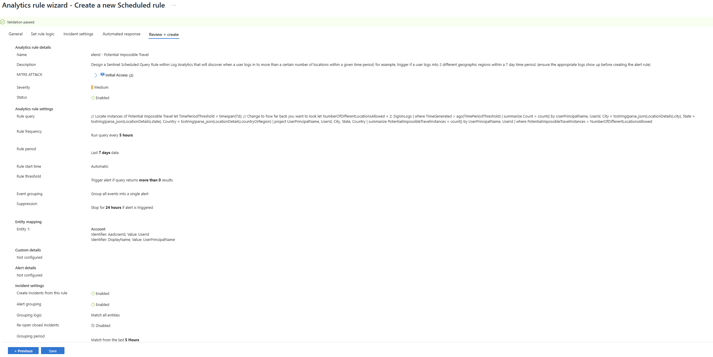
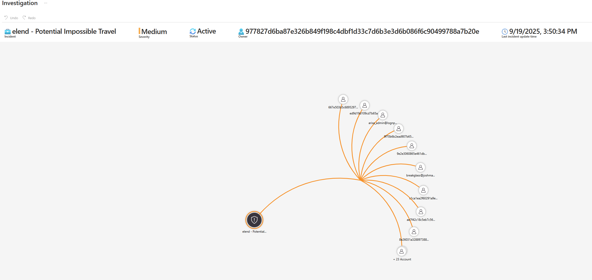
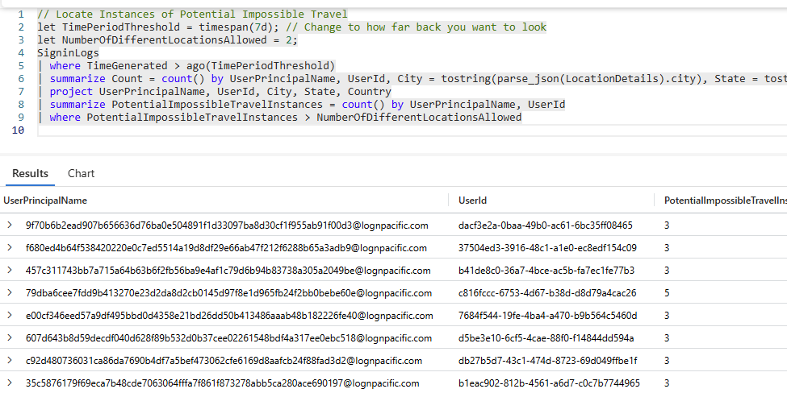

# 🚨 Incident Response: Potential Impossible Travel  

## Detection and Analysis  

An alert was generated in Microsoft Sentinel under the rule **"elend – Potential Impossible Travel"**.  
This rule is designed to detect suspicious sign-in activity where a single user account appears to authenticate from multiple geographic regions within an unrealistic timeframe.  


  

  


**Rule Logic:**  
- **Source Table:** SignInLogs  
- **Threshold:** More than 2 different login locations within 7 days  
- **Run Frequency:** Every 5 hours  
- **Severity:** Medium  
- **Tactics (MITRE ATT&CK):** Initial Access (TA0001)  

**Query Used:**  

```kql
let TimePeriodThreshold = timespan(7d); 
let NumberOfDifferentLocationsAllowed = 2;
SigninLogs
| where TimeGenerated > ago(TimePeriodThreshold)
| summarize Count = count() by UserPrincipalName, UserId, City = tostring(parse_json(LocationDetails).city), State = tostring(parse_json(LocationDetails).state), Country = tostring(parse_json(LocationDetails).countryOrRegion)
| project UserPrincipalName, UserId, City, State, Country
| summarize PotentialImpossibleTravelInstances = count() by UserPrincipalName, UserId
| where PotentialImpossibleTravelInstances > NumberOfDifferentLocationsAllowed
```


  


**Investigation Findings**:

Several accounts triggered this alert for logging in from 3+ unique locations in a short time window.

No successful sign-ins appeared tied to malicious IP addresses; activity was limited to geographic anomalies.

This type of detection often produces false positives due to:

VPN usage

Federated authentication redirects

Time zone/logging mismatches


**Containment, Eradication, and Recovery**

Cross-referenced accounts against known sign-in patterns for employees (no anomalies confirmed).

Checked all flagged accounts in Entra ID sign-in logs and MDE for concurrent suspicious activity — none found.

No containment action required.


**Post-Incident Activities**

Added conditional access policies to strengthen sign-in controls:

Require MFA for all external logins.

Apply sign-in risk evaluation with Identity Protection.

Documented rule as medium-confidence, high-false-positive for tuning.

Scheduled follow-up to review whether custom tuning is needed (e.g., excluding corporate VPN ranges).


**MITRE ATT&CK Framework Mapping**

**TA0001** – Initial Access

**T1078** – Valid Accounts (potential credential misuse)

**T1078.004** – Cloud Accounts (Azure AD accounts at risk from anomalous login activity)
