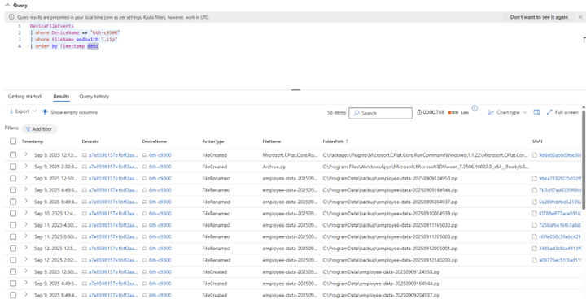
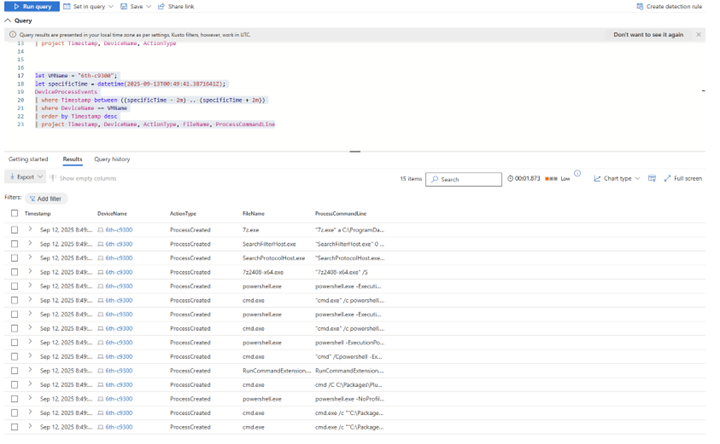

# Threat Hunting Scenario: Suspected Data Exfiltration

This threat hunt focused on detecting and investigating unusual file archiving behavior across endpoints, with a particular interest in ZIP file creation and potential data staging activities.  

---

## 📖 Summary & Findings  

During a hunt in **MDE DeviceFileEvents**, I queried for any activity involving `.zip` file creation. The search revealed frequent archiving activity on a specific endpoint (`6th-c9300`) where files were being compressed and moved to a *backup* folder.  

```kql
DeviceFileEvents
| where DeviceName == "6th-c9300"
| where FileName endswith ".zip"
| order by Timestamp desc
```

From there, I pivoted to DeviceProcessEvents within the same time window to identify what process initiated the archiving. The analysis revealed a PowerShell script that silently installed 7-Zip and immediately used it to compress employee data into archives.





```kql
let VMName = "6th-c9300";
let specificTime = datetime(2025-09-13T00:49:41.3871641Z);
DeviceProcessEvents
| where Timestamp between ((specificTime - 2m) .. (specificTime + 2m))
| where DeviceName == VMName
| order by Timestamp desc
| project Timestamp, DeviceName, ActionType, FileName, ProcessCommandLine
```

Finally, I validated whether there was any sign of data exfiltration by pivoting to DeviceNetworkEvents during the same timeframe. No outbound network activity was detected, suggesting the activity may have been limited to internal staging rather than immediate exfiltration.





```kql
let VMName = "6th-c9300";
let specificTime = datetime(2025-09-13T00:49:41.3871641Z);
DeviceNetworkEvents
| where Timestamp between ((specificTime - 2m) .. (specificTime + 2m))
| where DeviceName == VMName
| order by Timestamp desc
```

📌 Outcome:
The results were escalated to management, highlighting repeated archiving operations via PowerShell. No exfiltration was confirmed, but the activity remains suspicious due to its automation, silent installation of tooling, and potential staging of sensitive data.

🛡️ MITRE ATT&CK Mapping

T1059.001 – Command and Scripting Interpreter: PowerShell
Silent use of PowerShell to install and execute 7-Zip.

T1560.001 – Archive Collected Data: Archive via Utility
Data was compressed into ZIP files using 7-Zip, a common staging technique.

T1070.004 – Indicator Removal on Host: File Deletion
Archiving and moving files into backup directories may suggest staging or evasion tactics.

T1105 – Ingress Tool Transfer
Installation of 7-Zip onto the endpoint represents tool transfer into the environment.

T1055.011 – Process Injection: Extra Window Memory Injection (possible)
PowerShell’s silent operations can leverage injection-style techniques to evade detection.

T1027 – Obfuscated Files or Information
PowerShell scripts often involve obfuscation to avoid detection during execution.

T1047 – Windows Management Instrumentation (WMI) (possible)
Scripted installations and silent executions are often orchestrated through WMI.

🚀 Next Steps

Harden endpoint application controls to block unauthorized installations (e.g., 7-Zip).

Add detection rules for abnormal ZIP file creation activity.

Monitor PowerShell script execution with enhanced logging and alerting.

Continue monitoring for any delayed exfiltration attempts.
