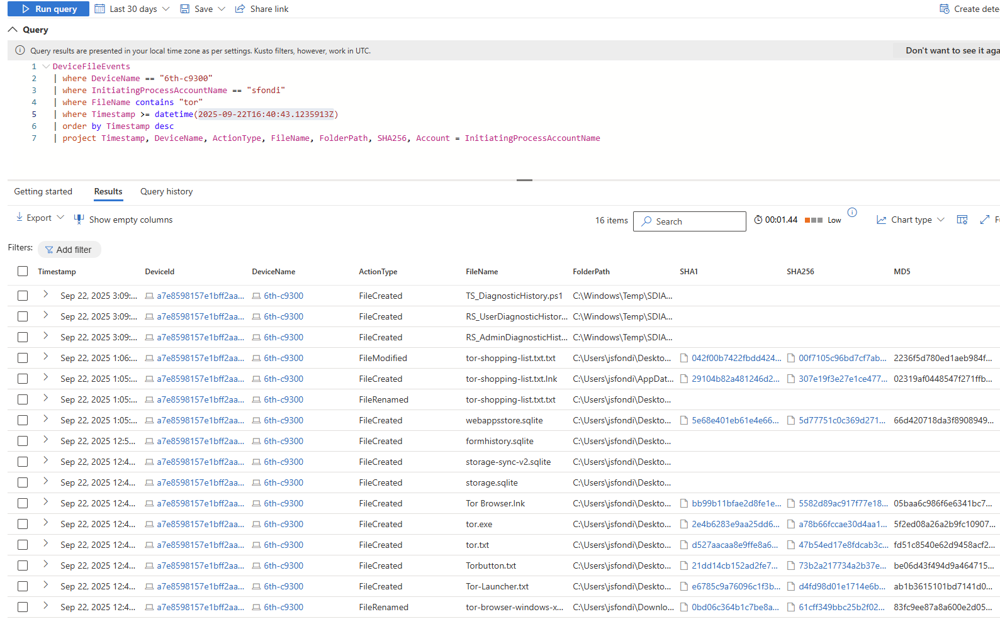
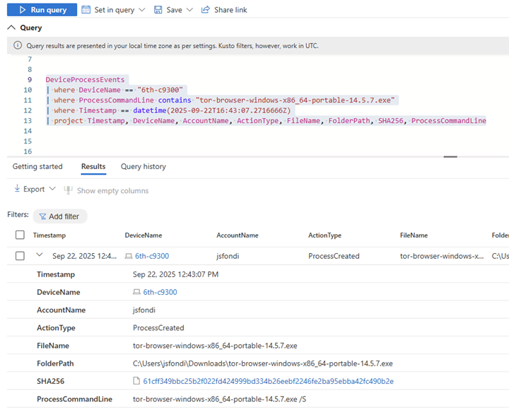
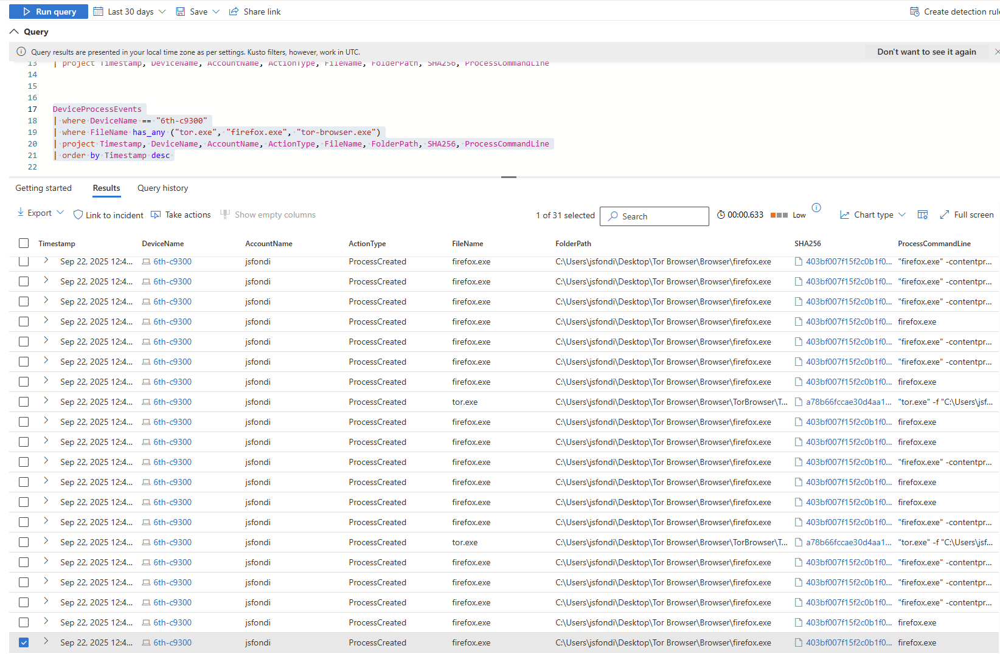
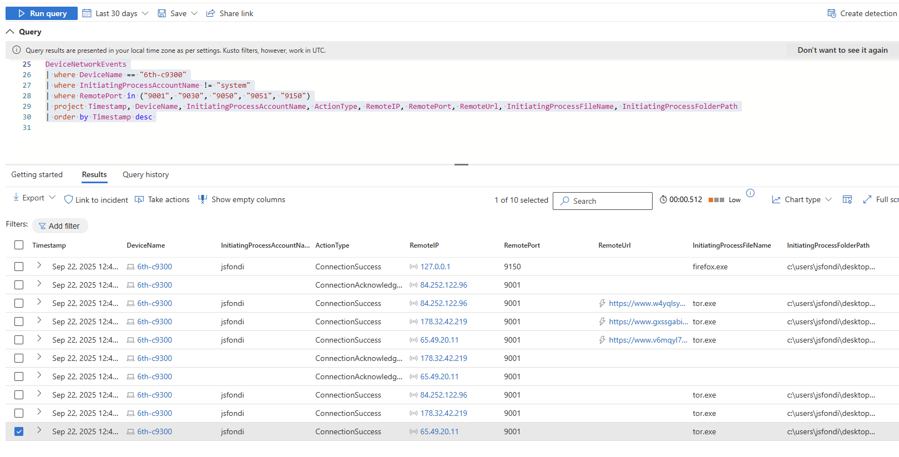

# 🕵️ Threat Hunting Scenario: Tor Browser Usage

## 🔎 Detection and Analysis  

While performing proactive hunting in Microsoft Defender for Endpoint (MDE), activity related to the **Tor Browser** was detected on device **6th-c9300**, linked to user **jsfondi**. Tor usage in a corporate environment can indicate attempts to bypass security controls, mask browsing activity, or engage in policy-violating behavior.

---

### 📂 File Discovery  

Initial hunt for any files containing the string `"tor"` in their names showed:  

- User `jsfondi` downloaded the **Tor installer**.  
- Multiple Tor-related files were copied to the user’s Desktop.  
- A suspicious file named **`tor-shopping-list.txt`** was created at **2025-09-22T17:05:48Z**.  

```kql
DeviceFileEvents
| where DeviceName == "6th-c9300"
| where InitiatingProcessAccountName == "jsfondi"
| where FileName contains "tor"
| where Timestamp >= datetime(2025-09-22T16:40:43.1235913Z)
| order by Timestamp desc
| project Timestamp, DeviceName, ActionType, FileName, FolderPath, SHA256, Account = InitiatingProcessAccountName
```





⚙️ Process Execution

Investigation into process execution revealed:

At 16:43:07Z, jsfondi executed the file tor-browser-windows-x86_64-portable-14.5.7.exe from their Downloads folder, silently installing Tor.

By 16:43:30Z, tor.exe and firefox.exe (Tor shell) processes were spawned, confirming installation and launch.

Multiple subsequent executions confirmed active usage.


```kql
DeviceProcessEvents
| where DeviceName == "6th-c9300"
| where ProcessCommandLine contains "tor-browser-windows-x86_64-portable-14.5.7.exe"
| where Timestamp == datetime(2025-09-22T16:43:07.2716666Z)
| project Timestamp, DeviceName, AccountName, ActionType, FileName, FolderPath, SHA256, ProcessCommandLine
```





```kql
DeviceProcessEvents
| where DeviceName == "6th-c9300"
| where FileName has_any ("tor.exe", "firefox.exe", "tor-browser.exe")
| project Timestamp, DeviceName, AccountName, ActionType, FileName, FolderPath, SHA256, ProcessCommandLine
| order by Timestamp desc
```





🌐 Network Activity

Evidence of Tor network usage was confirmed:

At 16:46:20Z, tor.exe connected to 65.49.20.11 on port 9001.

Additional relay IPs included:

178.32.42.219:9001

84.252.122.96:9001

Local proxy binding observed on 127.0.0.1:9150 (standard Tor SOCKS port).


```kql
DeviceNetworkEvents
| where DeviceName == "6th-c9300"
| where InitiatingProcessAccountName != "system"
| where RemotePort in ("9001", "9030", "9050", "9051", "9150")
| project Timestamp, DeviceName, InitiatingProcessAccountName, ActionType, RemoteIP, RemotePort, RemoteUrl, InitiatingProcessFileName, InitiatingProcessFolderPath
| order by Timestamp desc
```





🗓️ Chronological Timeline

16:40:43 UTC → Initial hunting query shows activity linked to user jsfondi.

16:43:07 UTC → Silent execution of Tor installer.

16:43:26–16:43:30 UTC → Tor-related files created on Desktop, tor.exe and firefox.exe spawned.

16:43:37–16:45:10 UTC → Repeated Tor process executions confirm active use.

16:46:20–16:46:56 UTC → Network connections established to multiple Tor relay IPs.

17:05:48 UTC → Creation of tor-shopping-list.txt, suggesting potential misuse of Tor for illicit activity


📌 Summary

User jsfondi on device 6th-c9300:

Downloaded and silently installed Tor.

Successfully launched the Tor Browser.

Established multiple connections to Tor relays.

Created a file named tor-shopping-list.txt, raising additional concerns.


🛡️ Response Taken

✅ Confirmed Tor usage on endpoint 6th-c9300.

🔒 Device was isolated.

👤 User’s direct manager was notified for HR/security review.


🗺️ MITRE ATT&CK Mapping

T1059.001 – Command and Scripting Interpreter: PowerShell (silent installer execution)

T1105 – Ingress Tool Transfer (download and installation of Tor)

T1071.001 – Application Layer Protocol: Web Protocols (Tor connections over ports 9001, 9150)

T1036 – Masquerading (Tor Browser processes appear as firefox.exe)
