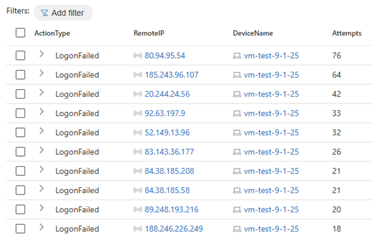
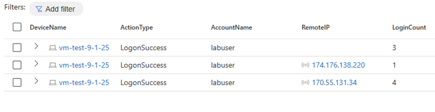

# Threat Hunting Scenario: Accidental VM Internet Exposure

This scenario investigates a virtual machine (`vm-test-9-1-25`) that was unintentionally exposed to the internet for several days. Threat hunting efforts focused on determining if brute force or unauthorized access attempts had succeeded, correlating failed logins, and validating the legitimacy of successful logons.

---

## 📖 Timeline Summary & Findings

### 🔎 Internet Exposure
```kql
DeviceInfo
| where DeviceName == "vm-test-9-1-25"
| where IsInternetFacing == true
| order by Timestamp desc
```
Last internet-facing timestamp: **2025-09-03T07:50:17Z**

🚨 **Brute Force Attempts**

```
DeviceLogonEvents
| where DeviceName == "vm-test-9-1-25"
| where LogonType has_any("Network", "Interactive", "RemoteInteractive", "Unlock")
| where ActionType == "LogonFailed"
| where isnotempty(RemoteIP)
| summarize Attempts = count() by ActionType, RemoteIP, DeviceName
| order by Attempts
```

  

Several IP addresses attempted repeated logins

**Top 5 failing IPs**: 80.94.95.54, 185.243.96.107, 20.244.24.56, 92.63.197.9, 52.149.13.96.

None were able to successfully authenticate

✅ **Validation of Successes**
```
let RemoteIPsInQuestion = dynamic(["80.94.95.54","185.243.96.107", "20.244.24.56", "92.63.197.9", "52.149.13.96"]);
DeviceLogonEvents
| where LogonType has_any("Network", "Interactive", "RemoteInteractive", "Unlock")
| where ActionType == "LogonSuccess"
| where RemoteIP has_any(RemoteIPsInQuestion)
```


 

**Result**: No successful logons from the malicious IPs


🧑‍💻 Legitimate Account Logons
```
DeviceLogonEvents
| where DeviceName == "vm-test-9-1-25"
| where LogonType == "Network"
| where ActionType == "LogonSuccess"
| where AccountName == "labuser"
| summarize count()
```

**72 total successful logons** by labuser in the last 30 days.

No failed logons for labuser, reducing likelihood of brute-force success.

Review of all successful labuser logon IPs showed normal, expected locations.

📊 **Findings**

VM was internet-facing and targeted by multiple brute force attempts.

No evidence of successful unauthorized access.

Legitimate account (labuser) activity was normal and consistent.

🛡️ **Mitigations Applied**

Hardened the NSG: RDP restricted to specific endpoints, no public internet access.

Implemented account lockout policies.

Enabled multi-factor authentication (MFA) for privileged accounts.


🎯 **Relevant MITRE ATT&CK TTPs**

T1190: Exploit Public-Facing Application

T1078: Valid Accounts

T1110: Brute Force

T1587.001: Develop Capabilities: Exploit Code
