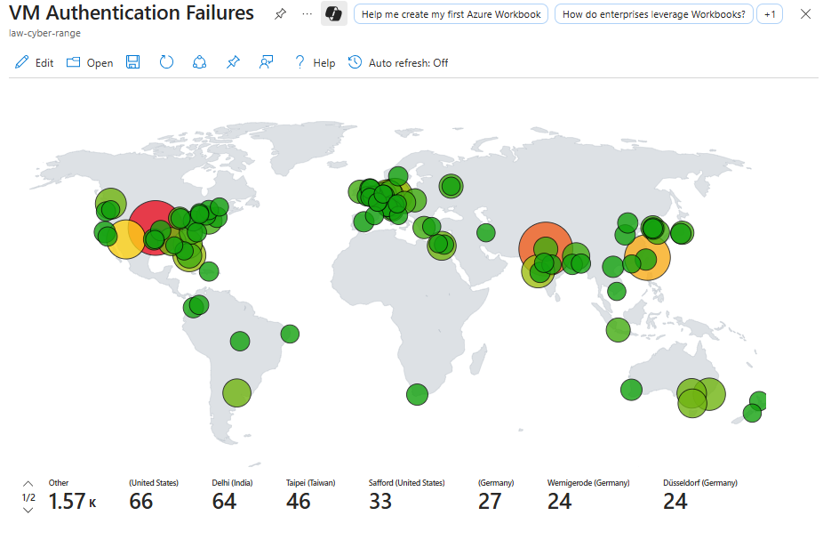

# VM Authentication Failures Workbook

This workbook uses **Microsoft Sentinel / Log Analytics** to visualize failed logon attempts to **virtual machines (VMs)** across the globe. By correlating device logon events with geolocation enrichment from a **GeoIP watchlist**, it helps security teams quickly identify patterns of brute force activity, unauthorized access attempts, and hotspots of malicious traffic.

  

---

## 📖 Description

- **Signal:** `DeviceLogonEvents`  
- **Scope:** Failed VM login attempts (`ActionType == "LogonFailed"`)  
- **Where:** IPv4 caller IPs joined to GeoIP watchlist for country/city attribution  
- **Window:** Last 30 days (adjustable in the workbook time picker)  

The visualization projects failed authentication counts on a world map, where bubble size and color intensity represent the **volume of login failures** from a given region.

---

## 🔎 KQL Query

```kql
let GeoIPDB_FULL = _GetWatchlist("geoip");
DeviceLogonEvents
| where ActionType == "LogonFailed"
| summarize LoginAttempts = count() by
    DeviceName,
    AccountName,
    Country = tostring(RemoteIPCountry),
    Latitude,
    Longitude
| project
    DeviceName,
    AccountName,
    Country,
    Latitude,
    Longitude,
    LoginAttempts,
    friendly_location = strcat(AccountName, " - ", Country)
```

🌍 Visualization

Type: Map (Lat/Long)

Location fields: Latitude, Longitude

Bubble size: LoginAttempts (count)

Bubble color: Heatmap (green → red) for density/severity

Label: friendly_location (<account> - <country>)

📷 Screenshots

   


⚡ Use Cases

Detecting brute force login attempts from specific geographies.

Identifying top targeted accounts or devices by failed attempts.

Spotting suspicious login failures from regions outside normal business operations.

Supporting incident response by providing quick visual context of where attacks originate.

🧩 Tips

Add filters for DeviceName or AccountType to drill into high-value systems.

Pair this workbook with alerts on repeated failures to proactively flag attacks.

Cross-reference with successful logins to see if failures led to eventual compromise.

Consider enriching further with threat intel feeds for known malicious IP ranges.
