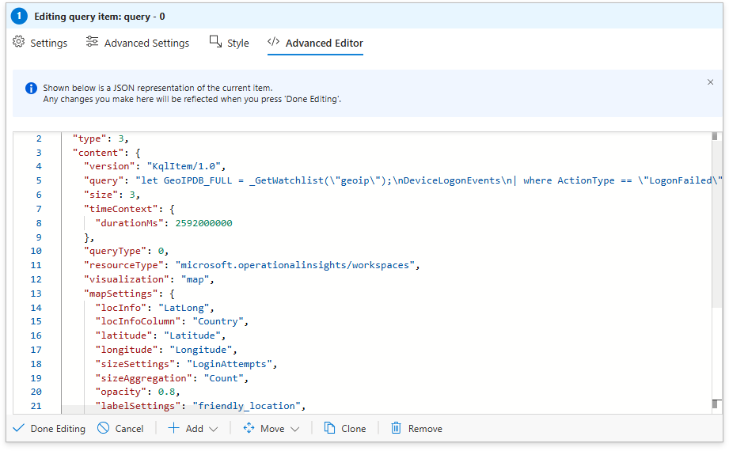

# VM Authentication Failures Workbook

This workbook visualizes **failed VM logons** across the globe using **Microsoft Sentinel / Log Analytics**. It enriches `DeviceLogonEvents` with a GeoIP watchlist and plots **where** failures originate, helping you spot brute-force hotspots, noisy sources, and unusual geographies at a glance.

  

---

## 📖 Description

- **Signal:** `DeviceLogonEvents`
- **Scope:** `ActionType == "LogonFailed"`
- **Enrichment:** IPv4 → Geo (city/country/lat/long) via a watchlist named **`geoip`**
- **Window:** Last 30 days (set by workbook time picker)

---

## 🔎 KQL Query

> **Prereq:** A watchlist named **`geoip`** with IPv4 networks and geo columns  
> (e.g., `network`, `cityname`, `countryname`, `latitude`, `longitude`).

```kql
let GeoIPDB_FULL = _GetWatchlist("geoip");
DeviceLogonEvents
| where ActionType == "LogonFailed"
| order by TimeGenerated desc
| evaluate ipv4_lookup(GeoIPDB_FULL, RemoteIP, network)
| summarize
    LoginAttempts = count()
  by
    RemoteIP,
    City = cityname,
    Country = countryname,
    friendly_location = strcat(cityname, " (", countryname, ")"),
    Latitude = latitude,
    Longitude = longitude
```
🌍 Visualization

Type: Map (Lat/Long)

Location fields: Latitude, Longitude

Bubble size: LoginAttempts (Count)

Bubble color: Heatmap (greenRed) by LoginAttempts

Label: friendly_location (e.g., Taipei (Taiwan))

📷 Screenshots

   


⚡ Use Cases

Detect brute-force sources and geographies with high failure volume

Identify noisy IPs to block or rate-limit at the edge

Compare failure spikes to maintenance windows or policy changes

Pivot from a hotspot to RemoteIP for deeper IR triage

🧩 Tips

Add filters for DeviceName, AccountName, or ActionType variants to drill in

Pair with a successful logon workbook to check if failures led to compromise

Feed known-bad IP ranges into the geoip watchlist or a companion TI table
